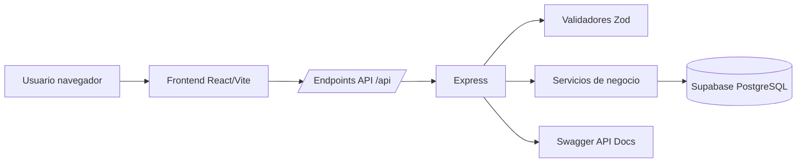
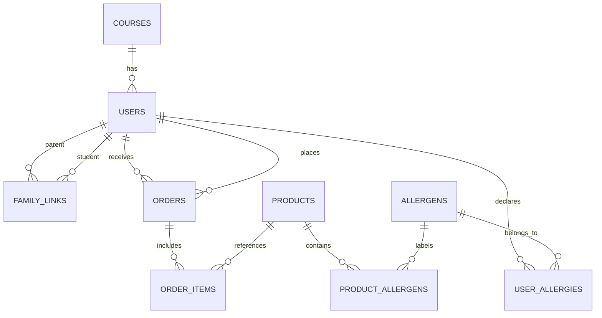

# Memoria de Proyecto Intermodular - DAM

# CafeteriaSolo / KOMO

## 1. Introducción

### 1.1 Presentación del proyecto

CafeteriaSolo, presentado en la interfaz como **KOMO**, es una aplicación web orientada a la gestión de pedidos anticipados en una cafetería escolar. El sistema permite que el alumnado consulte productos, revise información alimentaria, añada artículos al carrito y realice pedidos para su recogida. También incorpora un panel de administración para gestionar productos, pedidos, previsión de producción y cola de cocina.

El proyecto se ha desarrollado como una solución web completa, con frontend, backend, base de datos y despliegue. La aplicación está pensada para un contexto educativo real, donde la cafetería necesita organizar la demanda, reducir esperas y tener mayor control sobre alérgenos, pedidos y saldo.

### 1.2 Contexto y necesidad de la solución propuesta

En muchos centros educativos, la compra en cafetería se realiza de forma presencial y concentrada en periodos cortos, como recreos o cambios de turno. Esto provoca colas, falta de previsión para cocina, dificultad para controlar productos y poca trazabilidad sobre alérgenos o pedidos.

La solución propuesta digitaliza ese proceso. El alumno puede pedir con antelación y la cafetería puede preparar los productos de forma organizada. Las familias pueden consultar y recargar el saldo de alumnos vinculados, y el personal administrador dispone de herramientas para controlar la operación diaria.

### 1.3 Funcionalidades principales del sistema

- Inicio de sesión y registro de usuarios.
- Gestión de roles: alumno, familiar, administrador, staff y delegado.
- Catálogo de productos con categorías, precios y alérgenos.
- Detalle de producto con información sanitaria y personalizaciones.
- Carrito y creación de pedidos.
- Aviso de alérgenos antes de confirmar pedidos.
- Historial y detalle de pedidos.
- Monedero del alumno y movimientos.
- Vinculación familiar mediante códigos temporales.
- Panel de administración para productos, pedidos, KDS, familias y ajustes.
- Configuración de horarios de corte.
- Documentación API mediante Swagger.
- Despliegue en Vercel y opción de despliegue como servicio Node.

### 1.4 Tecnologías empleadas en el desarrollo

- **Frontend**: React, Vite, TypeScript, Tailwind CSS, lucide-react.
- **Backend**: Node.js, Express, TypeScript.
- **Validación**: Zod.
- **Base de datos**: Supabase/PostgreSQL.
- **Documentación API**: Swagger UI y swagger-jsdoc.
- **Pruebas**: Vitest.
- **Despliegue**: Vercel y alternativa Node.
- **Control de versiones**: Git y GitHub.

## 2. Objetivos del Proyecto

### 2.1 Objetivo general

Desarrollar una aplicación web funcional para gestionar pedidos anticipados en una cafetería escolar, integrando frontend, backend, base de datos, reglas de negocio, administración, familias y despliegue.

### 2.2 Objetivos específicos

- Crear una interfaz móvil sencilla para alumnos y familias.
- Permitir la consulta de productos y su información alimentaria.
- Implementar carrito y flujo de creación de pedidos.
- Registrar y consultar pedidos con distintos estados.
- Gestionar alérgenos declarados por el usuario.
- Avisar antes de confirmar pedidos con posibles conflictos alimentarios.
- Crear un panel de administración para la operación diaria.
- Implementar una cola KDS para cocina.
- Permitir vinculación entre familiares y alumnos.
- Gestionar saldo o monedero escolar.
- Diseñar una base de datos relacional coherente.
- Validar datos de entrada en backend.
- Preparar la aplicación para despliegue.
- Documentar técnicamente el proyecto.

## 3. Contexto y justificación

### 3.1 Problema detectado o necesidad a cubrir

El problema principal es la falta de digitalización en la gestión de pedidos de cafetería escolar. Sin una herramienta específica, la cafetería trabaja con poca previsión, los alumnos esperan en cola y las familias no tienen visibilidad sobre saldo, consumo o restricciones alimentarias.

Además, la información sobre alérgenos suele depender de cartelería o comunicación manual. Esto aumenta el riesgo de errores y dificulta que el alumno tome decisiones informadas.

### 3.2 Justificación tecnológica del desarrollo

Una aplicación web permite acceder desde móviles, tablets u ordenadores sin instalación obligatoria. React y Vite facilitan una interfaz rápida y moderna, mientras que Express y Supabase permiten construir una API clara y una persistencia relacional.

El uso de TypeScript reduce errores durante el desarrollo. Zod aporta validación explícita de entradas. Supabase ofrece una base PostgreSQL gestionada, adecuada para usuarios, pedidos, productos, alérgenos y relaciones familiares.

### 3.3 Impacto esperado y valor aportado

El proyecto aporta valor a tres perfiles:

- **Alumnado**: puede pedir de forma rápida y revisar alérgenos.
- **Familias**: pueden supervisar saldo y vincularse con alumnos.
- **Cafetería/administración**: obtiene previsión, control de pedidos y cola de preparación.

El impacto esperado es reducir tiempos de espera, mejorar la planificación de cocina y aumentar la seguridad alimentaria.

## 4. Especificaciones del Proyecto

### 4.1 Funcionalidades clave del sistema

#### Aplicación del alumno

- Login y registro.
- Catálogo de productos.
- Filtro por categorías.
- Detalle de producto.
- Personalización de productos.
- Carrito.
- Confirmación de pedido.
- Aviso de alérgenos.
- Consulta de pedidos.
- Monedero y movimientos.
- Perfil y configuración de alérgenos.

#### Aplicación familiar

- Vinculación con alumnos.
- Consulta de hijos vinculados.
- Recarga de saldo.
- Consulta de movimientos y pedidos.

#### Panel administrador

- Previsión de producción.
- KDS o cola de cocina.
- Gestión de productos.
- Gestión de pedidos.
- Gestión de delegados.
- Gestión de relaciones familiares.
- Ajustes de horarios de corte.

### 4.2 Requisitos no funcionales generales

- Interfaz responsive y orientada a móvil.
- Backend separado por capas.
- Validación de datos de entrada.
- Uso de variables de entorno para secretos.
- Despliegue reproducible.
- Persistencia relacional.
- Código tipado con TypeScript.
- Mensajes de error comprensibles.
- Documentación técnica y manuales.

## 5. Análisis de Requisitos

### 5.1 Requisitos funcionales

| Código | Requisito |
| --- | --- |
| RF-01 | El usuario puede iniciar sesión mediante correo. |
| RF-02 | El usuario puede registrarse como alumno o familiar. |
| RF-03 | El alumno puede consultar productos activos. |
| RF-04 | El alumno puede filtrar productos por categoría. |
| RF-05 | El alumno puede consultar detalle, precio y alérgenos de un producto. |
| RF-06 | El alumno puede añadir productos al carrito. |
| RF-07 | El sistema calcula el total del pedido. |
| RF-08 | El sistema advierte si hay conflicto con alérgenos declarados. |
| RF-09 | El alumno puede confirmar un pedido. |
| RF-10 | El alumno puede consultar pedidos y detalle. |
| RF-11 | Administración puede consultar pedidos operativos. |
| RF-12 | Administración puede actualizar estados de pedidos. |
| RF-13 | Administración puede consultar KDS. |
| RF-14 | Administración puede crear y editar productos. |
| RF-15 | Administración puede configurar horarios de corte. |
| RF-16 | Un familiar puede generar códigos de vinculación. |
| RF-17 | Un alumno puede canjear un código de vinculación. |
| RF-18 | Un familiar puede recargar saldo de un alumno vinculado. |
| RF-19 | El sistema puede listar alérgenos disponibles. |
| RF-20 | El usuario puede actualizar sus alérgenos. |

### 5.2 Requisitos no funcionales detallados

| Código | Requisito |
| --- | --- |
| RNF-01 | La aplicación debe poder usarse desde navegador móvil. |
| RNF-02 | El frontend debe compilarse para producción con Vite. |
| RNF-03 | El backend debe validar entradas con esquemas Zod. |
| RNF-04 | Las credenciales y claves no deben almacenarse en el repositorio. |
| RNF-05 | La API debe separar rutas, controladores y servicios. |
| RNF-06 | El despliegue debe permitir comprobar salud mediante `/api/health`. |
| RNF-07 | La base de datos debe mantener integridad referencial. |
| RNF-08 | Las cantidades y precios deben evitar valores negativos. |
| RNF-09 | La interfaz debe mantener contraste legible. |
| RNF-10 | Las operaciones críticas deben devolver errores claros. |

## 6. Diseño de la Solución

### 6.1 Arquitectura del sistema

La arquitectura sigue un modelo cliente-servidor:

- El usuario interactúa con el frontend React.
- El frontend llama a endpoints `/api`.
- Express recibe las peticiones y aplica validaciones.
- Los servicios de backend consultan o modifican Supabase.
- La base PostgreSQL almacena usuarios, productos, pedidos, alérgenos y familias.

#### Modelo de comunicación

La comunicación se realiza mediante HTTP y JSON. Los endpoints protegidos usan cabeceras de autenticación mock durante esta versión:

- `x-user-id`
- `x-user-role`
- `x-user-beneficiary`

#### Tecnologías base en cada capa

- Presentación: React + Tailwind CSS.
- Lógica API: Express + TypeScript.
- Validación: Zod.
- Datos: Supabase/PostgreSQL.
- Despliegue: Vercel o Node.

### 6.2 Diagrama de arquitectura



### 6.3 Diseño de base de datos

El diseño usa un modelo relacional. Las entidades principales son:

- `courses`: cursos escolares.
- `users`: usuarios y roles.
- `family_links`: vínculos entre familiares y alumnos.
- `linking_tokens`: códigos temporales de vinculación.
- `products`: productos de cafetería.
- `allergens`: alérgenos normalizados.
- `product_allergens`: relación muchos a muchos entre productos y alérgenos.
- `user_allergies`: alérgenos declarados por usuarios.
- `orders`: pedidos.
- `order_items`: líneas de pedido.
- `settings`: configuración global.

#### Diagrama Entidad Relación



#### Estados del pedido

- `PENDING`: pendiente.
- `IN_PREPARATION`: en preparación.
- `READY`: listo.
- `DELIVERED`: entregado.
- `CANCELLED`: cancelado.

## 7. Desarrollo e implementación

### 7.1 Tecnologías utilizadas en frontend, backend y despliegue

#### Frontend

El frontend se desarrolló en React con Vite. Se diseñó con enfoque móvil, navegación inferior, carrito modal, pantallas de perfil, pedidos, monedero y panel administrador.

Tailwind CSS se empleó para el sistema visual. Durante el desarrollo se corrigieron problemas de contraste y clases de color para que los botones y elementos interactivos fueran legibles.

#### Backend

El backend usa Express y TypeScript. La lógica está dividida en:

- Rutas.
- Controladores.
- Servicios.
- Validadores.
- Middlewares.
- Configuración.

#### Despliegue

Vercel genera `client-dist` y usa una función `api/index.ts` para redirigir `/api/*` al backend Express. También existe la opción de desplegar en Node con `npm run build` y `npm start`.

### 7.2 Flujo de desarrollo

El desarrollo se realizó por iteraciones:

1. Definición del dominio y estructura backend.
2. Creación de base de datos y seed.
3. Implementación de endpoints principales.
4. Desarrollo de interfaz móvil.
5. Integración de carrito y pedidos.
6. Añadido de alérgenos y validaciones.
7. Incorporación de familias y monedero.
8. Implementación del panel de administración y KDS.
9. Corrección de despliegue en Vercel.
10. Revisión visual de colores, tarjetas y tipografías.
11. Documentación final.

### 7.3 Integración de módulos/componentes

#### Integración cliente-servidor

El frontend usa un wrapper `useApi` que inyecta cabeceras de autenticación y centraliza llamadas HTTP. Además existe `client/lib/api.ts` para soportar URL de API configurable mediante `VITE_API_BASE_URL`.

#### Integración de servicios externos

Supabase se utiliza como base de datos gestionada. La conexión se configura con variables de entorno.

#### Validaciones y seguridad

- Validaciones con Zod en creación de pedidos, login, registro, administración y settings.
- Cabeceras mock para roles en esta versión.
- Variables sensibles fuera del repositorio.
- Control de productos activos.
- Control de alérgenos antes de crear pedidos.

### 7.4 Despliegue

#### Vercel

Se usa para servir el frontend y una API serverless conectada a Express:

- `vercel.json` define build y rewrites.
- `client-dist` es el directorio de salida.
- `/api/*` se redirige a `api/index.ts`.

#### Node

El proyecto también puede desplegarse como servicio Node:

```bash
npm run build
npm start
```

En este modo Express sirve tanto API como frontend.

## 8. Pruebas de validación

### 8.1 Pruebas funcionales

Se han validado manualmente los siguientes flujos:

- Acceso a `/api/health`.
- Login con usuarios demo.
- Carga de productos.
- Carga de fuentes y assets en Vercel.
- Navegación por pantalla de productos.
- Visualización de tarjetas de producto.
- Carrito y resumen de pedido.
- Consulta de pedidos.
- Panel de administración.
- KDS.
- Relación familiar.
- Despliegue en Vercel.

### 8.2 Pruebas automatizadas

Se han implementado pruebas con Vitest:

- `roundMoney`: redondeo monetario.
- `buildCancellationDeadline`: cálculo de límite de cancelación.

Resultado actual:

- 2 ficheros de test.
- 10 pruebas superadas.

### 8.3 Pruebas no funcionales

- Build de backend y frontend.
- Build de cliente en Vercel.
- Validación de rutas estáticas y assets.
- Comprobación de errores de service worker.
- Revisión de contraste visual.
- Comprobación de que `.env` no se sube al repositorio.

## 9. Conclusiones y líneas de mejora

### 9.1 Resultados obtenidos

El resultado es una aplicación funcional que cubre el flujo principal de cafetería escolar:

- Los alumnos pueden consultar productos y crear pedidos.
- La administración puede gestionar la operativa.
- El sistema contempla alérgenos, familias y monedero.
- La API está estructurada y validada.
- La aplicación se puede desplegar.

### 9.2 Limitaciones detectadas

- La autenticación es demo y se basa en cabeceras mock, no en JWT o sesiones reales.
- No existe todavía integración de pago real.
- La PWA/offline se ha desactivado temporalmente para evitar problemas de caché.
- No hay suite E2E completa.
- El panel administrador puede seguir mejorándose en usabilidad y permisos.
- La cancelación de pedidos tiene reglas que deben revisarse para producción real.

### 9.3 Propuestas de mejora y trabajo futuro

- Implementar autenticación real con JWT o Supabase Auth.
- Añadir pasarela de pago real o recarga segura de monedero.
- Crear pruebas E2E con Playwright.
- Añadir métricas de producción y reportes para cocina.
- Mejorar control de stock.
- Añadir notificaciones push.
- Restaurar PWA con estrategia correcta de caché versionada.
- Añadir roles y permisos más granulares.
- Crear panel de informes para ventas, productos más pedidos y horas punta.

## 10. Bibliografía

- React. Documentación oficial: https://react.dev/
- Vite. Documentación oficial: https://vite.dev/
- Express. Documentación oficial: https://expressjs.com/
- TypeScript. Documentación oficial: https://www.typescriptlang.org/
- Tailwind CSS. Documentación oficial: https://tailwindcss.com/
- Supabase. Documentación oficial: https://supabase.com/docs
- Zod. Documentación oficial: https://zod.dev/
- Vitest. Documentación oficial: https://vitest.dev/
- Vercel. Documentación oficial: https://vercel.com/docs
- Reglamento UE 1169/2011 sobre información alimentaria facilitada al consumidor.

## 11. Anexos

### 11.1 Capturas de la aplicación

Se recomienda incluir capturas de:

- Login.
- Catálogo de productos.
- Detalle de producto.
- Carrito.
- Pedidos.
- Monedero.
- Perfil.
- Panel de administración.
- KDS.

### 11.2 Manual de despliegue

El manual de despliegue está disponible en:

- `documentacion/06-Despliegue.md`

### 11.3 Manual de usuario

El manual de usuario está disponible en:

- `documentacion/03-Manual-Usuario.md`

### 11.4 Documentación técnica

La documentación técnica está disponible en:

- `documentacion/01-Documentacion-Tecnica.md`

### 11.5 Diagrama ERD

El diagrama de entidad-relación está disponible en:

- `db/erd.mmd`
