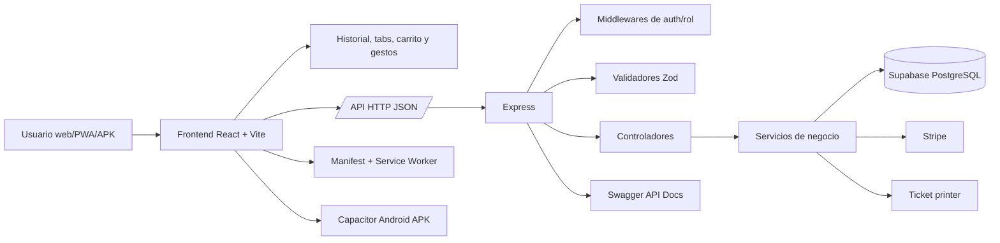
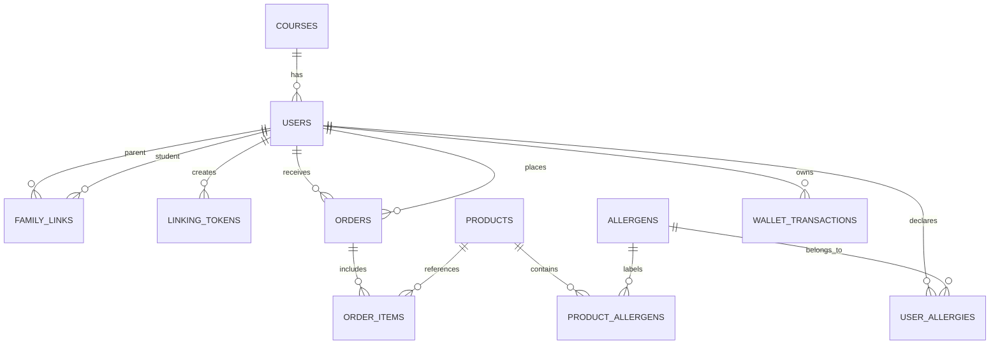

# Memoria de Proyecto Intermodular - DAM

# CafeteriaSolo / KOMO

## 1. Introducción

### 1.1 Presentación del proyecto

CafeteriaSolo, presentado al usuario final bajo la marca **KOMO**, es una aplicación web y móvil orientada a la gestión de pedidos anticipados en una cafetería escolar. El sistema permite que el alumnado consulte el menú, revise la información alimentaria de cada producto, añada artículos al carrito y realice pedidos para su recogida en el centro. Además, incorpora un área familiar para supervisar hijos vinculados y monedero, y un panel de administración para gestionar productos, pedidos, cola de cocina, previsión de producción y configuración operativa.

El proyecto se ha planteado como una solución realista de ciclo completo: interfaz de usuario, API, base de datos, validaciones, documentación, pruebas, despliegue web, modo PWA instalable y empaquetado Android mediante Capacitor. De esta forma, no se limita a ser una maqueta visual, sino que cubre el flujo técnico completo necesario para que una cafetería escolar pueda organizar su operativa diaria.

### 1.2 Contexto y necesidad de la solución propuesta

En muchos centros educativos, la compra en cafetería se concentra en franjas muy cortas, como recreos o cambios de turno. Este funcionamiento provoca colas, pedidos improvisados, falta de previsión en cocina y dificultad para controlar qué productos se deben preparar en cada momento. También complica la comunicación de información importante, como alérgenos, disponibilidad de productos o estado de los pedidos.

La solución propuesta digitaliza el proceso. El alumnado puede preparar su pedido antes de llegar a la cafetería, la cocina puede visualizar una cola ordenada de preparación y las familias pueden consultar saldo, recargar monedero y vincularse con alumnos. Además, el sistema facilita que la información alimentaria esté disponible dentro de la propia ficha de producto, reduciendo la dependencia de carteles físicos o comunicación manual.

### 1.3 Funcionalidades principales del sistema

Las funcionalidades principales de KOMO son:

- Registro e inicio de sesión para distintos tipos de usuario.
- Gestión de roles: alumno, familiar, administrador, staff y delegado.
- Catálogo de productos activos organizado por categorías.
- Ficha de producto con precio, alérgenos e información técnica alimentaria.
- Personalización de productos, selección de extras y retirada de ingredientes.
- Carrito de compra y confirmación de pedidos.
- Aviso de alérgenos antes de finalizar el pedido.
- Consulta de pedidos, estados y detalle de líneas.
- Monedero del alumno, movimientos y recargas.
- Vinculación entre familiares y alumnos mediante códigos temporales.
- Pago y recargas con integración Stripe en modo test.
- Panel de administración para productos, pedidos, estudiantes y relaciones familiares.
- KDS o cola de cocina para preparar pedidos.
- Previsión de producción para anticipar demanda.
- Ticket operativo para cocina/mostrador.
- PWA instalable desde navegador compatible.
- APK Android generado con Capacitor bajo el nombre **KOMOAPK**.
- Navegación móvil con gestos, botón atrás controlado y animaciones de deslizamiento.

### 1.4 Tecnologías empleadas en el desarrollo

El proyecto utiliza una arquitectura web moderna basada en TypeScript:

- **Frontend**: React 19, Vite 8, TypeScript, Tailwind CSS v4 y lucide-react.
- **Backend**: Node.js, Express, TypeScript y Zod para validaciones.
- **Base de datos**: Supabase sobre PostgreSQL.
- **Pagos**: Stripe API, Stripe.js y componentes React de Stripe.
- **PWA**: manifest, iconos instalables y service worker versionado.
- **Android**: Capacitor 8, Gradle y proyecto Android nativo.
- **Documentación API**: Swagger UI y swagger-jsdoc.
- **Pruebas**: Vitest.
- **Despliegue**: Vercel para la app web y Railway como API accesible desde el APK.
- **Control de versiones**: Git y GitHub.

## 2. Objetivos del Proyecto

### 2.1 Objetivo general

Desarrollar una aplicación funcional para la gestión digital de pedidos anticipados en una cafetería escolar, integrando una experiencia móvil cómoda para alumnado y familias, un backend validado, una base de datos relacional, herramientas de administración, despliegue web y empaquetado Android.

### 2.2 Objetivos específicos

- Crear una interfaz responsive, clara y optimizada para uso móvil.
- Permitir que el alumnado consulte el catálogo real de cafetería y solo vea productos activos.
- Incorporar fichas técnicas alimentarias con datos plausibles cuando el producto no tenga información completa en base de datos.
- Implementar carrito, cálculo de totales y flujo de confirmación de pedidos.
- Advertir al usuario cuando un producto contiene alérgenos declarados en su perfil.
- Gestionar pedidos con estados operativos desde administración.
- Crear una cola KDS para cocina que facilite la preparación.
- Permitir que las familias se vinculen con alumnos mediante códigos temporales.
- Implementar monedero escolar, movimientos y recargas.
- Integrar Stripe para guardar tarjetas y realizar recargas en modo test.
- Diseñar una base de datos relacional coherente y ampliable.
- Validar las entradas del backend con esquemas Zod.
- Documentar endpoints y reglas de negocio mediante Swagger y documentación Markdown.
- Preparar la aplicación como PWA instalable.
- Generar una APK Android funcional mediante Capacitor.
- Comprobar que la APK usa una API remota accesible desde el móvil.
- Mejorar la navegación móvil mediante gestos, historial y animaciones de transición.
- Verificar el proyecto mediante build, tests automatizados y validación de firma APK.

## 3. Contexto y justificación

### 3.1 Problema detectado o necesidad a cubrir

El problema principal es la falta de digitalización en la gestión de pedidos de cafetería escolar. En un sistema tradicional, el alumno decide y paga directamente en mostrador. Esto provoca acumulación de usuarios en poco tiempo, pedidos poco previsibles y mayor presión para el personal de cafetería.

También existen necesidades relacionadas con la seguridad alimentaria. Un alumno con alergias necesita identificar rápidamente qué productos contienen ingredientes problemáticos. Si esta información se gestiona solo de forma manual, aumenta el riesgo de error, olvido o falta de actualización.

Por último, las familias no siempre tienen visibilidad sobre el saldo disponible, los pedidos realizados o la forma de recargar. La aplicación resuelve esta necesidad con un área familiar que centraliza hijos vinculados, monedero y movimientos.

### 3.2 Justificación tecnológica del desarrollo

La elección de una aplicación web permite acceder desde navegador, instalarla como PWA y empaquetarla posteriormente como APK sin duplicar la interfaz. Esto resulta adecuado para un entorno educativo, donde pueden convivir dispositivos Android, iOS, tablets y ordenadores.

React y Vite proporcionan una base rápida para crear interfaces dinámicas. TypeScript ayuda a reducir errores de tipado y facilita el mantenimiento. Express permite construir una API sencilla, organizada por rutas, controladores y servicios. Supabase aporta una base PostgreSQL gestionada, adecuada para un dominio relacional con usuarios, pedidos, productos, alérgenos, familias y monedero.

Capacitor se justifica porque permite reutilizar la aplicación React/Vite como aplicación Android. En este proyecto se usa para generar una APK real, configurar el nombre **KOMOAPK**, aplicar icono de app y mejorar el comportamiento móvil, incluyendo pantalla completa y navegación mediante historial.

### 3.3 Impacto esperado y valor aportado

El proyecto aporta valor a varios perfiles:

- **Alumnado**: reduce esperas, permite revisar productos antes de pedir y muestra advertencias de alérgenos.
- **Familias**: permite controlar saldo, consultar hijos vinculados y realizar recargas.
- **Cafetería**: facilita planificación, preparación de pedidos y control del catálogo activo.
- **Administración del centro**: obtiene una solución documentada, ampliable y con despliegue reproducible.

El impacto esperado es reducir tiempos de espera, mejorar la planificación de cocina, disminuir errores en pedidos y aumentar la seguridad alimentaria del servicio.

## 4. Especificaciones del Proyecto

### 4.1 Funcionalidades clave del sistema

#### Aplicación del alumno

- Registro e inicio de sesión.
- Catálogo de productos activos.
- Filtro por categorías: bebidas calientes, bebidas frías, bocadillos, sándwiches, bollería, golosinas y extras.
- Detalle de producto con precio, alérgenos e información técnica.
- Personalización de productos cuando aplica.
- Añadido de productos al carrito.
- Confirmación de pedido.
- Aviso previo ante posibles conflictos de alérgenos.
- Consulta de pedidos realizados.
- Consulta del monedero y movimientos.
- Gestión de perfil y alérgenos personales.

#### Aplicación familiar

- Consulta de hijos vinculados.
- Generación y canje de códigos de vinculación.
- Consulta de saldo de cada alumno.
- Recarga de monedero.
- Recarga mediante tarjeta en modo test con Stripe.
- Consulta de pedidos y movimientos del alumno vinculado.
- Acceso a perfil del hijo para ver información relevante.

#### Panel administrador

- Gestión del catálogo de productos.
- Activación y desactivación de productos.
- Creación y edición de productos.
- Visualización de pedidos operativos.
- Cambio de estado de pedidos.
- KDS para cocina.
- Previsión de producción.
- Gestión de estudiantes y delegados.
- Gestión de relaciones familiares.
- Configuración de horarios de corte.
- Prueba y previsualización de ticket.

#### PWA y APK Android

- Manifest e iconos instalables.
- Service worker versionado para controlar caché.
- APK generada con Capacitor.
- Nombre visible **KOMOAPK**.
- Icono de aplicación basado en el logo del proyecto.
- Pantalla completa en Android para evitar la barra superior del sistema.
- Botón atrás adaptado al flujo interno de la app.
- Gestos horizontales para cambiar de pestaña.
- Animaciones de deslizamiento entre vistas.

### 4.2 Requisitos no funcionales generales

- La interfaz debe ser responsive y estar pensada para móvil.
- La aplicación debe ser usable como web, PWA y APK Android.
- El backend debe estar separado por capas.
- Los datos de entrada deben validarse antes de ejecutar lógica de negocio.
- Las credenciales deben mantenerse fuera del repositorio mediante variables de entorno.
- El catálogo debe ocultar productos desactivados en la vista de compra.
- La API debe ofrecer un endpoint de salud (`/api/health`).
- El despliegue debe ser reproducible.
- La base de datos debe mantener integridad referencial.
- La aplicación debe devolver mensajes de error comprensibles.
- El código debe estar escrito en TypeScript siempre que sea posible.

## 5. Análisis de Requisitos

### 5.1 Requisitos funcionales

| Código | Requisito |
| --- | --- |
| RF-01 | El usuario puede iniciar sesión mediante correo. |
| RF-02 | El usuario puede registrarse como alumno o familiar. |
| RF-03 | El sistema asigna roles para controlar vistas y permisos. |
| RF-04 | El alumno puede consultar productos activos. |
| RF-05 | El alumno puede filtrar productos por categoría. |
| RF-06 | El alumno puede abrir la ficha de producto. |
| RF-07 | El sistema muestra precio, alérgenos e información alimentaria. |
| RF-08 | El sistema genera información técnica estimada cuando no exista ficha completa. |
| RF-09 | El alumno puede añadir productos al carrito. |
| RF-10 | El alumno puede personalizar productos cuando estén configurados. |
| RF-11 | El sistema calcula subtotal y total del pedido. |
| RF-12 | El sistema advierte si hay conflicto con alérgenos declarados. |
| RF-13 | El alumno puede confirmar un pedido. |
| RF-14 | El alumno puede consultar pedidos y estados. |
| RF-15 | El alumno puede cancelar pedidos si se cumplen las reglas de tiempo. |
| RF-16 | Administración puede consultar pedidos operativos. |
| RF-17 | Administración puede actualizar estados de pedidos. |
| RF-18 | Administración puede consultar la cola KDS. |
| RF-19 | Administración puede crear, editar, activar y desactivar productos. |
| RF-20 | Administración puede configurar horarios de corte. |
| RF-21 | Un familiar puede consultar hijos vinculados. |
| RF-22 | Un familiar puede generar códigos de vinculación. |
| RF-23 | Un alumno puede canjear un código de vinculación. |
| RF-24 | Un familiar puede recargar saldo de un alumno vinculado. |
| RF-25 | El sistema registra movimientos de monedero. |
| RF-26 | El usuario puede consultar y actualizar sus alérgenos. |
| RF-27 | El usuario puede guardar información resumida de tarjeta. |
| RF-28 | El sistema permite recargas con Stripe en modo test. |
| RF-29 | La aplicación permite instalarse como PWA. |
| RF-30 | La aplicación puede empaquetarse como APK Android. |
| RF-31 | El botón atrás del móvil navega dentro de la app antes de cerrarla. |
| RF-32 | Los gestos horizontales permiten cambiar de pestaña en móvil. |

### 5.2 Requisitos no funcionales detallados

| Código | Requisito |
| --- | --- |
| RNF-01 | La aplicación debe poder usarse desde navegador móvil. |
| RNF-02 | La aplicación debe compilarse para producción con Vite. |
| RNF-03 | La APK debe conectarse a una API remota mediante `VITE_API_BASE_URL`. |
| RNF-04 | El backend debe validar entradas con Zod. |
| RNF-05 | Las credenciales no deben almacenarse en el repositorio. |
| RNF-06 | Las claves públicas de cliente deben separarse de claves secretas de servidor. |
| RNF-07 | La API debe separar rutas, controladores, servicios y validadores. |
| RNF-08 | Los precios y cantidades deben evitar valores negativos. |
| RNF-09 | La interfaz debe tener contraste suficiente y textos legibles. |
| RNF-10 | Los productos desactivados no deben aparecer en la vista de compra. |
| RNF-11 | Las operaciones críticas deben devolver errores claros. |
| RNF-12 | La base de datos debe mantener relaciones entre pedidos y líneas. |
| RNF-13 | El service worker debe versionarse para evitar cachés obsoletas. |
| RNF-14 | Las transiciones móviles no deben bloquear formularios ni diálogos. |
| RNF-15 | La APK debe estar firmada al menos como debug para pruebas en dispositivo. |
| RNF-16 | El proyecto debe incluir documentación técnica, manuales y pruebas. |

## 6. Diseño de la Solución

### 6.1 Arquitectura del sistema

La arquitectura sigue un modelo cliente-servidor:

- El usuario interactúa con el frontend React.
- El frontend llama a endpoints `/api` mediante peticiones HTTP en JSON.
- Express recibe las peticiones, aplica middlewares y valida entradas.
- Los controladores delegan la lógica en servicios.
- Los servicios consultan o modifican Supabase/PostgreSQL.
- La administración y el KDS usan endpoints protegidos por rol.
- Stripe se utiliza para flujos de tarjeta y recarga.
- Capacitor envuelve la build web para generar una APK Android.

#### Modelo de comunicación

La comunicación se realiza mediante HTTP y JSON. Durante esta versión se mantiene compatibilidad con cabeceras de autenticación de desarrollo:

- `x-user-id`
- `x-user-role`
- `x-user-beneficiary`

Esta decisión permite probar roles y flujos completos mientras la autenticación definitiva se consolida con Supabase Auth o JWT. Las rutas críticas siguen validando rol, datos de entrada y reglas de negocio.

#### Tecnologías base en cada capa

| Capa | Tecnologías |
| --- | --- |
| Presentación | React, Vite, TypeScript, Tailwind CSS, lucide-react |
| Estado cliente | Context API, hooks propios, historial del navegador |
| API | Node.js, Express, TypeScript |
| Validación | Zod |
| Datos | Supabase/PostgreSQL |
| Pagos | Stripe SetupIntent y PaymentIntent |
| Documentación | Swagger UI, Markdown |
| PWA | Manifest, service worker, iconos |
| Android | Capacitor, Gradle, JDK 21 |
| Pruebas | Vitest |
| Despliegue | Vercel, Railway y modo Node |

#### Herramientas complementarias

- Git para control de versiones.
- Scripts `npm` para desarrollo, build, test y APK.
- Mermaid para diagramas en documentación.
- Variables de entorno para configurar Supabase, Stripe y URL de API.

### 6.2 Diagrama de arquitectura



### 6.3 Diseño de base de datos

El modelo de datos es relacional. Sus entidades principales son:

- `courses`: cursos escolares.
- `users`: usuarios con rol, saldo, teléfono, curso y datos resumidos de pago.
- `family_links`: vínculos activos entre familiares y alumnos.
- `linking_tokens`: códigos temporales para vinculación familiar.
- `products`: productos del catálogo.
- `allergens`: catálogo normalizado de alérgenos.
- `product_allergens`: relación muchos a muchos entre productos y alérgenos.
- `user_allergies`: alérgenos declarados por usuarios.
- `orders`: pedidos realizados.
- `order_items`: líneas de pedido.
- `wallet_transactions`: movimientos de monedero.
- `settings`: configuración global, como horarios de corte.
- Campos Stripe en `users`: cliente Stripe, método de pago guardado y últimos dígitos visibles de tarjeta.

#### Diagrama Entidad Relación



#### Estados del pedido

| Estado | Descripción |
| --- | --- |
| `PENDING` | Pedido creado y pendiente de preparación. |
| `IN_PREPARATION` | Pedido en cocina. |
| `READY` | Pedido preparado para recoger. |
| `DELIVERED` | Pedido entregado. |
| `CANCELLED` | Pedido cancelado según reglas del sistema. |

#### Catálogo y fichas técnicas

El catálogo se actualizó con el menú real de cafetería, incluyendo bebidas calientes, bebidas frías, bocadillos, sándwiches, extras, bollería y golosinas. La vista de compra filtra productos desactivados para que no aparezcan al alumnado.

Cuando la base de datos no dispone de una ficha técnica completa para un producto, el frontend utiliza una función de resolución que genera información alimentaria plausible según el tipo de producto. Esto permite mantener una experiencia completa mientras se aplican todas las migraciones definitivas en producción.

## 7. Desarrollo e implementación

### 7.1 Tecnologías utilizadas en frontend, backend y despliegue

#### Frontend

El frontend se desarrolló en React con Vite y TypeScript. La interfaz está organizada en pantallas: inicio/catálogo, monedero, pedidos, perfil, perfil de hijo y administración. Se emplean componentes reutilizables para carrito, detalle de producto, advertencia de alérgenos, modales de Stripe y paneles familiares.

El diseño está optimizado para móvil. Incluye navegación inferior por pestañas, tarjetas de producto, vistas compactas y gestos táctiles. Además, se añadieron animaciones de deslizamiento entre pestañas y entrada animada en el detalle de producto.

#### Backend

El backend usa Express y TypeScript. La estructura se divide en:

- `routes`: definición de endpoints por dominio.
- `controllers`: recepción de peticiones y respuestas HTTP.
- `services`: lógica de negocio.
- `validators`: esquemas Zod.
- `middlewares`: autenticación, roles, errores y ventanas horarias.
- `config`: entorno, Supabase, Swagger y horarios.

Esta separación facilita pruebas, mantenimiento y evolución del proyecto.

#### Base de datos

Supabase/PostgreSQL almacena usuarios, cursos, productos, alérgenos, pedidos, líneas de pedido, relaciones familiares, movimientos de monedero, ajustes y métodos de pago Stripe. Las migraciones se encuentran en la carpeta `db/migrations`.

#### Despliegue

La aplicación se prepara para varios entornos:

- **Vercel**: sirve la aplicación web y redirige `/api/*` a la entrada serverless.
- **Railway**: API remota accesible desde dispositivos móviles y APK.
- **Node tradicional**: `npm run build` y `npm start`, sirviendo backend y frontend compilado.
- **Android**: build web en modo `android`, sincronización con Capacitor y generación de APK debug.

### 7.2 Flujo de desarrollo

El desarrollo se organizó por iteraciones:

1. Definición del dominio de cafetería escolar.
2. Creación de estructura backend y endpoints iniciales.
3. Diseño de base de datos y migraciones.
4. Implementación de autenticación demo y roles.
5. Creación del catálogo y flujo de pedido.
6. Integración de alérgenos y advertencias.
7. Desarrollo de monedero y movimientos.
8. Incorporación del sistema familiar.
9. Desarrollo del panel administrador y KDS.
10. Integración de Stripe para tarjetas y recargas.
11. Mejora visual del frontend móvil.
12. Configuración PWA con manifest, iconos y service worker.
13. Configuración Capacitor y generación de APK Android.
14. Ajuste de gestos, botón atrás y animaciones para uso móvil.
15. Validación mediante build, tests y comprobación de APK.
16. Documentación técnica, manuales y memoria.

### 7.3 Integración de módulos/componentes

#### Integración cliente-servidor

El frontend centraliza llamadas en utilidades de API y hooks. En navegador web puede utilizar rutas relativas `/api`, mientras que la APK requiere una URL absoluta mediante `VITE_API_BASE_URL`. Por este motivo existe un entorno específico `.env.android`, que apunta a una API remota accesible desde el móvil.

#### Integración de servicios externos

Supabase se utiliza como servicio de base de datos PostgreSQL. Stripe se integra para guardar tarjetas y realizar recargas en modo test. La impresora de tickets está contemplada mediante un servicio best-effort, de forma que un fallo de impresión no impide crear el pedido.

#### Validaciones y seguridad

El backend valida los cuerpos de entrada con Zod. También se comprueban reglas de negocio como productos activos, cantidades válidas, ventanas de cancelación, roles de administración y saldos de monedero. Las claves secretas se mantienen fuera del repositorio y se cargan con variables de entorno.

#### Integración móvil y gestos

La aplicación incorpora mejoras específicas para móvil:

- El botón atrás cierra primero modales o detalle de producto.
- Si el usuario está en una pestaña secundaria, atrás vuelve a la pestaña anterior antes de cerrar la app.
- Los gestos horizontales permiten cambiar entre catálogo, monedero, pedidos y perfil.
- Los gestos no interfieren con formularios, diálogos ni controles bloqueados.
- Las transiciones se animan con deslizamiento para que la navegación sea más natural.
- En Android se oculta la barra superior del sistema para aprovechar mejor la pantalla.

### 7.4 Despliegue

#### Despliegue web

El despliegue web funciona en Vercel. El frontend compila a `client-dist` y las rutas API se resuelven mediante la entrada serverless definida en `api/index.ts`. El archivo `vercel.json` configura build y rewrites.

#### Despliegue backend

La API puede desplegarse como servicio Node. En el entorno actual se utiliza una URL de Railway para que la APK Android pueda conectarse sin depender de que el PC de desarrollo esté encendido.

#### PWA

La PWA incluye:

- `manifest.json`.
- Iconos de 192 y 512 píxeles.
- Service worker propio.
- Caché versionada para evitar builds antiguas.
- Registro del service worker en producción.

#### APK Android

La APK se genera con Capacitor:

```bash
npm run android:apk:debug
```

El resultado se obtiene en:

```text
android/app/build/outputs/apk/debug/app-debug.apk
```

Para esta APK se configuró:

- Nombre visible: **KOMOAPK**.
- Icono de app basado en el logo.
- Conexión con API remota por `VITE_API_BASE_URL`.
- Build con JDK 21.
- Pantalla completa en Android.
- Firma debug verificada para instalación de pruebas.

## 8. Pruebas de validación

### 8.1 Pruebas funcionales

Se han validado manualmente los siguientes flujos:

- Acceso a `/api/health`.
- Inicio de sesión con usuarios demo.
- Carga de productos desde API.
- Comprobación de que solo aparecen productos activos en el menú de compra.
- Apertura de ficha técnica de producto.
- Añadido de productos al carrito.
- Confirmación de pedido.
- Advertencia de alérgenos.
- Consulta de pedidos y detalle.
- Cancelación según reglas temporales.
- Consulta de monedero y movimientos.
- Recarga de saldo familiar.
- Flujo Stripe en modo test.
- Vinculación familiar mediante código.
- Panel de administración.
- Gestión de productos.
- KDS y cambio de estados de pedido.
- Carga de assets, iconos y service worker en PWA.
- Navegación móvil con botón atrás.
- Cambio de pestañas mediante gesto horizontal.
- Animaciones de deslizamiento.
- APK instalada como aplicación Android de pruebas.

### 8.2 Pruebas automatizadas

Se han implementado pruebas con Vitest sobre utilidades y servicios:

- Redondeo monetario con `roundMoney`.
- Cálculo de límites de cancelación con `buildCancellationDeadline`.
- Lógica de vinculación familiar.

Resultado actual:

- 3 ficheros de test.
- 11 pruebas superadas.

### 8.3 Pruebas no funcionales

Las comprobaciones no funcionales realizadas incluyen:

- Build de cliente con `npm run build:client`.
- Build Android con Capacitor y Gradle.
- Verificación de firma de APK debug con `apksigner`.
- Revisión de variables de entorno para no subir secretos al repositorio.
- Comprobación de que la APK usa una API remota y no `localhost`.
- Validación de caché PWA mediante actualización de versión del service worker.
- Revisión de contraste visual en botones y tarjetas.
- Comprobación de que los gestos no rompen formularios ni modales.
- Validación de que productos desactivados no aparecen en el flujo de compra.

### 8.4 Resultado de validación técnica

El estado técnico validado es:

- La app web funciona desplegada.
- La PWA se puede instalar desde navegador compatible.
- La APK Android se genera correctamente.
- La APK no depende del PC local si apunta a la API remota.
- El catálogo real se encuentra activo y depurado.
- El sistema mantiene ficha técnica visible incluso si faltan datos extendidos en producción.
- La suite de tests automatizados se ejecuta correctamente.

## 9. Conclusiones y líneas de mejora

### 9.1 Resultados obtenidos

El resultado del proyecto es una aplicación funcional que cubre el flujo completo de una cafetería escolar:

- El alumnado puede consultar productos, revisar alérgenos y realizar pedidos.
- Las familias pueden vincular alumnos, ver saldo y recargar monedero.
- Administración puede gestionar productos, pedidos, KDS y configuración.
- El sistema integra base de datos relacional, API validada y despliegue.
- La aplicación puede usarse como web, PWA y APK Android.
- La experiencia móvil incluye gestos, botón atrás adaptado y animaciones.
- El catálogo se ha actualizado con el menú real de cafetería.

El proyecto demuestra la integración de conocimientos de desarrollo frontend, backend, bases de datos, despliegue, pruebas, documentación y empaquetado móvil.

### 9.2 Limitaciones detectadas

- La autenticación conserva compatibilidad con cabeceras demo, aunque está preparada para evolucionar hacia Supabase Auth o JWT.
- La integración Stripe se encuentra en modo test y requiere credenciales y webhooks finales para producción real.
- Algunas columnas de información extendida de producto dependen de migraciones pendientes en la base de datos de producción; por ello existe una ficha técnica estimada en frontend.
- El modo offline de la PWA es limitado, porque login, pedidos, perfil y pagos dependen de la API.
- La impresión de tickets está implementada como envío best-effort, pendiente de validación completa con la impresora física real.
- No existe todavía una suite E2E completa con Playwright.
- El control de stock puede ampliarse para reflejar unidades disponibles por turno.

### 9.3 Propuestas de mejora y trabajo futuro

- Sustituir definitivamente la autenticación demo por Supabase Auth o JWT.
- Aplicar todas las migraciones pendientes en producción y guardar fichas técnicas completas en base de datos.
- Completar pagos reales con webhooks Stripe y conciliación robusta.
- Añadir pruebas E2E con Playwright para login, pedido, pago y administración.
- Implementar notificaciones push para avisar cuando un pedido esté listo.
- Añadir control de stock por producto y turno.
- Crear informes de ventas por día, franja horaria y producto.
- Mejorar la estrategia offline de PWA para catálogo y KDS.
- Validar físicamente impresión en AVP-TC300 y ajustar protocolo si fuera necesario.
- Añadir permisos más granulares para staff, delegados y administración.
- Preparar una APK release firmada con keystore para distribución fuera de pruebas.

## 10. Bibliografía

- React. Documentación oficial: https://react.dev/
- Vite. Documentación oficial: https://vite.dev/
- Express. Documentación oficial: https://expressjs.com/
- TypeScript. Documentación oficial: https://www.typescriptlang.org/
- Tailwind CSS. Documentación oficial: https://tailwindcss.com/
- Supabase. Documentación oficial: https://supabase.com/docs
- Stripe. Documentación oficial: https://docs.stripe.com/
- Capacitor. Documentación oficial: https://capacitorjs.com/docs
- Android Developers. Documentación oficial: https://developer.android.com/
- Zod. Documentación oficial: https://zod.dev/
- Vitest. Documentación oficial: https://vitest.dev/
- Vercel. Documentación oficial: https://vercel.com/docs
- Railway. Documentación oficial: https://docs.railway.com/
- Reglamento (UE) n.º 1169/2011 sobre la información alimentaria facilitada al consumidor.
- Real Decreto 126/2015, relativo a la información alimentaria de alimentos sin envasar en España.

## 11. Anexos

### 11.1 Capturas de la aplicación

Se recomienda incluir capturas de:

- Login y registro.
- Catálogo de productos.
- Ficha técnica de producto.
- Carrito y advertencia de alérgenos.
- Confirmación o resumen de pedido.
- Pantalla de pedidos.
- Monedero.
- Perfil de usuario.
- Perfil familiar e hijos vinculados.
- Panel de administración.
- Gestión de productos.
- KDS o cola de cocina.
- App instalada como PWA.
- APK Android con nombre KOMOAPK e icono.

### 11.2 Manual de despliegue

El manual de despliegue está disponible en:

- `documentacion/06-Despliegue.md`

### 11.3 Manual de usuario

El manual de usuario está disponible en:

- `documentacion/09-Manual-Usuario.md`

### 11.4 Manual de administrador

El manual de administrador está disponible en:

- `documentacion/10-Manual-Administrador.md`

### 11.5 Documentación técnica

La documentación técnica está disponible en:

- `documentacion/01-Documentacion-Tecnica.md`

### 11.6 Manual de empaquetado Android

El empaquetado Android con Capacitor está documentado en:

- `documentacion/08-Android-APK.md`

### 11.7 Pruebas

La documentación de pruebas está disponible en:

- `documentacion/05-Pruebas.md`

### 11.8 Diagrama ERD

El diagrama de entidad-relación está disponible en:

- `db/erd.mmd`

### 11.9 Explicación del ERD

La explicación del esquema de base de datos está disponible en:

- `documentacion/11-Explicacion-ERD.md`

### 11.10 Comandos útiles

```bash
npm run dev
npm run dev:client
npm run build:client
npm test
npm run android:apk:debug
```

### 11.11 Variables de entorno principales

Las variables sensibles no se incluyen en la memoria. A nivel documental, el proyecto necesita:

- `SUPABASE_URL`
- `SUPABASE_ANON_KEY`
- `SUPABASE_SERVICE_ROLE_KEY`
- `STRIPE_SECRET_KEY`
- `VITE_STRIPE_PUBLISHABLE_KEY`
- `VITE_API_BASE_URL` para builds Android
